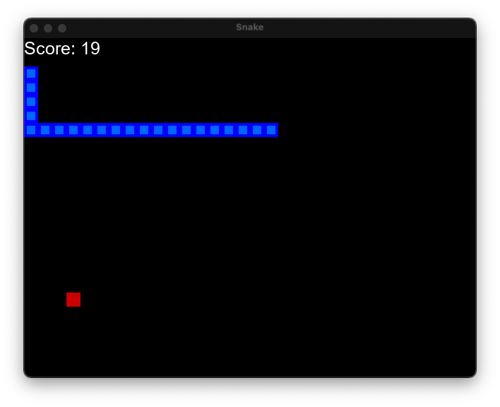
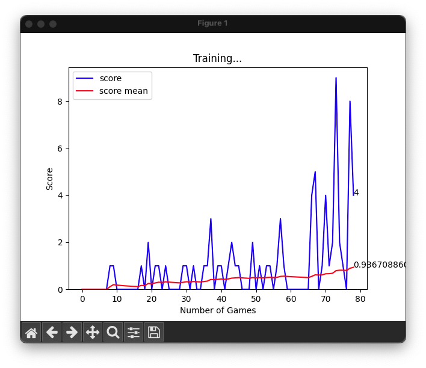
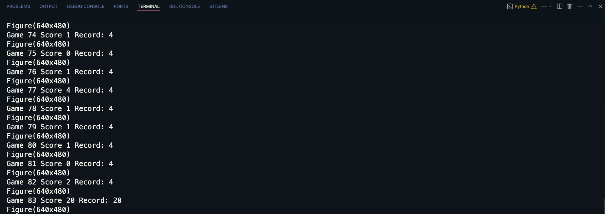

# Introduction
 This repo contains a Reinforcement Learning project which teaches an AI model to play the famous game *Snake*. The main game is designed using *Pygame*, the machine learning stuff are coded with *PyTorch* and the tables are drawn using *matplotlib*.
 
 # How to run the code
 Either clone are download this repo, then run the `agent.py` module. It shall take around 100 to 120 games/cycles until the agent can play the game well (the time needed to do so is something around 15 minutes).Obviously, the more time the agent plays, the better it performs.

 (The main files you need in order to run the code are `agent.py`, `helper.py`, `model.py`, `snake_game.py` and `arial.ttf`)

 Also, you can use the `requirements.txt` file to download required packages.

# Pictures
Below are a couple of pictures of the code being run:

- A snapshot of the game played by the agent

 

- Example of the generated plots showing the last score and the mean of the scores. It's noticible that the mean of the scores is ascending, showing that the agent is **learning** to play the game

 

- The logs written in terminal, showing the number of games being played, last score and the record

 
